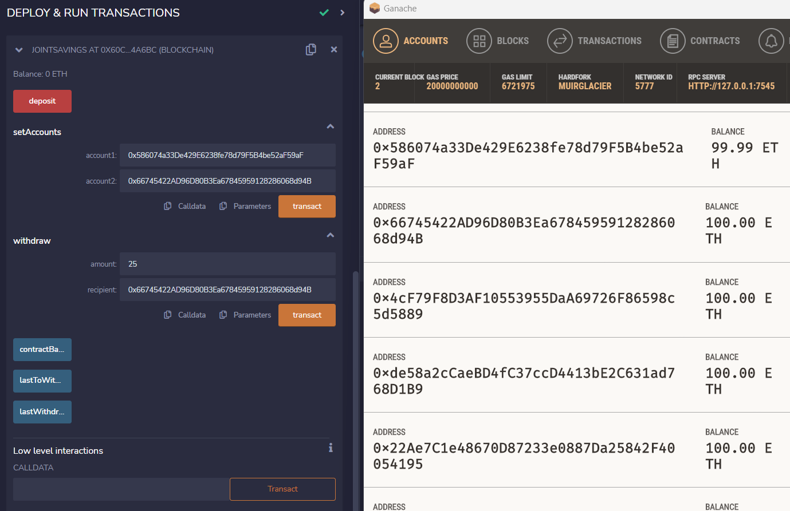

# Account Balance Transfer w Solidity 
## Purpose
This application mirrors the transfer of funds in ETHER between 2 joined accounts. 
Used solidity 5.0 and Ganache to test the balance transfer functions. 

---
## Technologies and files used
###  [Solidity](https://docs.soliditylang.org/en/v0.8.17/)  
    
  
-    `joint_savings.sol`

    Version:
    `pragma solidity 0.5.0`
### TEST Ethereum Wallet by [GANACHE](https://trufflesuite.com/ganache/)

### Ethereum IDE - [REMIX](https://remix.ethereum.org/)

## USE CASE and DEMO
---
### Open the solidity contract with IDE Remix

### Connect the contract with Ganache test account

### Deploy the contract

### Set up the accounts

### Execute the ETHER Transfer 

### NOTE the Balances and the Detain in the BLOCK to veify transaction

### NOTE the Transaction Detail under as a confirmation in solidity from REMIX

---

---
## Contributors
- Starter code provided by FinTech program by UW
---
## License
Tool is available under an MIT License.

---
## Aknowledgements
* [Markdown Guide](https://www.markdownguide.org/basic-syntax/#reference-style-links)
